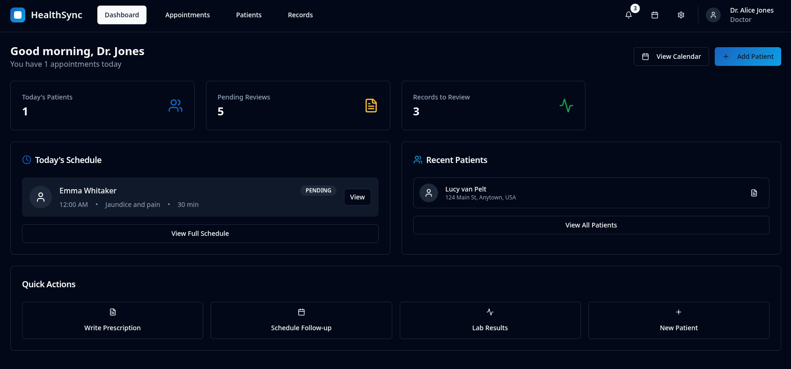

# HealthSync  

**HealthSync** is a modern healthcare management system designed to simplify patient and doctor interactions.  

## 🏗️ Project Structure

```
healthsync/
├── frontend/          # Next.js 14 frontend application
│   ├── src/          # Source code
│   ├── public/       # Static assets
│   └── prisma/       # Database schema (reference)
├── backend/          # Python FastAPI backend
│   ├── app/          # Application code
│   │   ├── api/      # API endpoints
│   │   ├── models/   # SQLAlchemy models
│   │   ├── db/       # Database configuration
│   │   └── core/     # Core utilities
│   └── main.py       # FastAPI entry point
└── README.md         # This file
```

## ✨ Features

### For Patients:
- Register for appointments online  
- Receive timely reminders about upcoming care  
- View prescriptions of previous appointments
- Access and review medical history  
- Manage profile and account settings

### For Doctors:
- View all upcoming appointments in a clean dashboard  
- Provide prescriptions digitally  
- Manage medicine schedules with ease  
- Manage schedule efficiently
- Access patient medical records

## 🚀 Quick Start

### Prerequisites
- Node.js 18+ (for frontend)
- Python 3.10+ (for backend)
- PostgreSQL 14+ (local or remote)
- pnpm (recommended for frontend)

### Backend Setup

```bash
# Navigate to backend
cd backend

# Create virtual environment
python -m venv venv

# Activate virtual environment
# Windows:
.\venv\Scripts\activate
# macOS/Linux:
source venv/bin/activate

# Install dependencies
pip install -r requirements.txt

# Set up environment variables
cp .env.example .env
# Edit .env with your database credentials

# Run the server (database will be auto-created)
python -m uvicorn main:app --reload --port 8000
```

Backend will be available at: http://localhost:8000

### Frontend Setup

```bash
# Navigate to frontend
cd frontend

# Install dependencies
pnpm install

# Set up environment variables
cp .env.example .env.local
# Edit .env.local with your configuration

# Run development server
pnpm dev
```

Frontend will be available at: http://localhost:3000

## 📚 Documentation

- [Frontend Documentation](./frontend/README.md)
- [Backend Database Setup](./backend/DATABASE_SETUP.md)
- [API Documentation](http://localhost:8000/docs) (when backend is running)

## 🛠️ Technology Stack

### Frontend
- **Framework:** Next.js 14 (App Router)
- **Language:** TypeScript
- **Styling:** Tailwind CSS
- **UI Components:** shadcn/ui
- **State Management:** React Context + SWR
- **Forms:** React Hook Form + Zod

### Backend
- **Framework:** FastAPI
- **Language:** Python 3.10+
- **Database:** PostgreSQL
- **ORM:** SQLAlchemy (async)
- **Authentication:** JWT (python-jose)
- **Password Hashing:** bcrypt

## 🔐 Authentication

The system uses JWT-based authentication:
1. Users register/login through the frontend
2. Backend generates JWT tokens
3. Tokens are stored in browser localStorage
4. All API requests include the JWT token in headers

## 🗄️ Database

The application uses PostgreSQL with automatic initialization:
- Tables are created automatically on first run
- SQLAlchemy models match Prisma schema
- Both frontend (Prisma) and backend (SQLAlchemy) can access the same database

Test accounts (password: `password123`):
- Doctor: `dr.smith@healthsync.com` (Cardiology)
- Doctor: `dr.jones@healthsync.com` (Pediatrics)
- Patient: `charlie.brown@example.com`
- Patient: `emma.johnson@example.com`

## 📸 Screenshots

